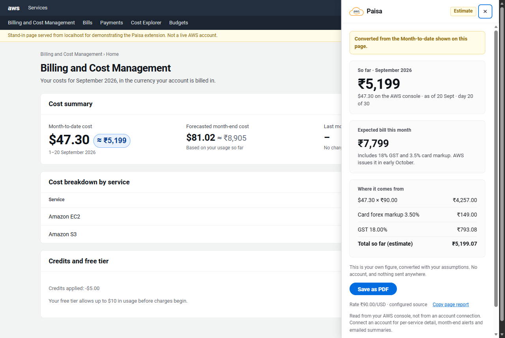
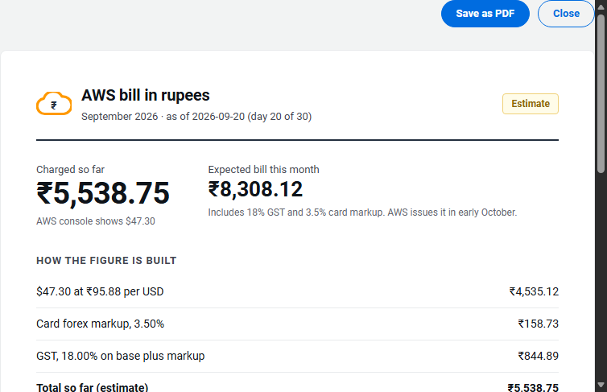

# Paisa — your AWS bill, in rupees

The AWS console shows you dollars. Your bank charges you rupees — at its own rate, on its own day, plus your card's foreign-currency markup, plus 18% GST. Nowhere does AWS show you all three together, so the number on screen is not the number that leaves your account.

Paisa puts the rupee figure next to it.



> Built for the WeMakeDevs **First Commit** hackathon. Every figure is an **estimate**: GST, forex and card markup depend on your AWS entity and your card issuer, so they are settings you control, not assumptions hidden in the code.

---

## Try it in two minutes

No account, no sign-up, no backend. It reads the figure already on your own AWS billing page.

1. Download `dist/paisa-extension-1.0.0.zip` and unzip it anywhere.
2. Open `edge://extensions` (or `chrome://extensions`), turn on **Developer mode**, click **Load unpacked**, and pick the unzipped folder.
3. Open your **AWS Billing and Cost Management** console — reload the tab if it was already open.
4. Click the **₹ Bill** button at the bottom right.

You will see your own month-to-date figure in rupees, the expected month-end bill with GST, and the whole conversion line by line.

**Nothing is sent anywhere.** The conversion happens in your browser. The only network request is for the public USD→INR rate, and it carries nothing but the currency pair.

If your account has no spend yet, there is no figure to read, and Paisa says so rather than inventing one.

---

## What it does

| | |
|---|---|
| **₹ Bill button** | On every AWS console page. Opens a panel with the bill in rupees |
| **Inline figures** | On billing pages, a small ₹ amount beside the console's own `$` figures |
| **The full conversion** | `USD × rate → + card markup → + GST → total`, every input visible |
| **Expected month-end bill** | Projected from your pace so far, with GST named in the sentence |
| **Save as PDF** | A printable report that carries its own caveats, because it gets forwarded |
| **Your assumptions** | AWS Inc or AISPL, your card's markup, your GST rate — all adjustable |
| **With an account** *(needs the backend deployed)* | Per-service breakdown from Cost Explorer, emailed summaries on the 1st and 15th, threshold alerts |

<p align="center">
  
</p>

## How it reads your bill

**It is not OCR, and it never touches your AWS account.**

The console has already fetched and rendered your figure. A content script walks the page's text nodes, matches text shaped like `$903.30`, and multiplies. No screenshots, no image processing, no AWS API calls, no credentials, no session tokens.

Worth being straight about the trade-off: the extension holds host permission for `*.console.aws.amazon.com`, so it *can* read any console page. It only acts on money-shaped text and stays quiet elsewhere — there are tests for that — but the capability is real, which is inherent to anything that augments a page. Plenty of organisations prohibit browser extensions on cloud consoles outright, and that is a reasonable policy.

[`PRIVACY.md`](PRIVACY.md) lists every field stored, why, and for how long.

## Architecture

```
  Browser extension (MV3)                  Next.js dashboard
  ₹ Bill button · panel · inline ₹         the same bill, without an extension
        │                                          │
        └──────── HTTPS + session token ───────────┘
                   (never an AWS credential)
                            ▼
                 API Gateway (HTTP API, throttled)
                            ▼
                    Lambda (Python 3.12)
         ┌──────────────┬──────────────┬──────────────┐
    DynamoDB           SNS       EventBridge    STS → your own account
  users · cache · fx  email       schedules     read-only role + ExternalId
```

Two decisions worth reading the code for:

- **Cost Explorer bills per request.** An extension that called it every time you opened the panel would charge you money to look at what you are spending. Spend is cached in DynamoDB for four hours, and even the refresh button cannot re-query more than once every 30 minutes. A cost decision, not a performance one — [`backend/src/spend_handler.py`](backend/src/spend_handler.py).
- **Some accounts cannot use Cost Explorer at all.** There is a second source, the free CloudWatch `AWS/Billing` metrics, and the app reports which one answered, so a coarse figure never poses as a precise one — [`backend/src/cw.py`](backend/src/cw.py).

Full detail in [`docs/architecture.md`](docs/architecture.md).

## Security

- **No AWS credential ever reaches the browser.** A test asserts the session token never appears in page-side state.
- Cross-account reads use **STS with a per-user `ExternalId`**, which is what prevents the confused-deputy problem.
- The role you install grants five read-only billing actions and nothing else. Delete its CloudFormation stack and access is gone.
- Deleting your data is two clicks in the popup, and it says what it *cannot* delete — the role living in your own account.

## Tests

Three layers, all runnable from a clone, none needing an AWS account:

```bash
pip install -r backend/requirements-dev.txt
python -m pytest backend/tests -q --cov=backend/src   # 101 tests, 98% coverage
python tests/e2e/run.py                               # 6 browser suites (156 checks)
python tests/e2e/run.py --from-zip                    # the same, against the shipped zip
cd web && npm ci && npm run lint && npm run build
```

The browser suites load the **real unpacked extension** into headless Edge and drive it over the DevTools protocol, against fixture pages standing in for the console. `--from-zip` runs them against the packaged artifact, because testing the source does not prove the package works.

Helpers: `scripts/check_aws.py` says whether this machine can deploy, `scripts/check_docs.py` verifies the figures in these docs match the repo, and `scripts/demo.py --standalone` opens a real browser with the extension loaded.

> **These suites need Edge.** Chrome 137+ ignores `--load-extension`, so they cannot automate it. The extension itself is plain MV3 and works in Chrome; it just has to be loaded by hand.

## Status

- [x] Extension: button, panel, inline figures, PDF export, settings
- [x] Backend: email sign-in, cached spend, CloudWatch fallback, emailed summaries, scheduled digest
- [x] Read-only role template with one-click CloudFormation install
- [x] Dashboard
- [ ] **Not deployed.** The AWS account for this project never finished signup — every deployable service answers `OptInRequired`. The extension works standalone regardless, and says so rather than pretending otherwise.

## Layout

```
extension/    the Manifest V3 extension (Edge and Chrome, one package)
backend/      AWS SAM stack: Lambda, API Gateway, DynamoDB, SNS, EventBridge
web/          Next.js dashboard
onboarding/   the read-only role users install
tests/e2e/    browser suites driving the real extension
scripts/      packaging, icons, AWS and docs checks, the demo launcher
docs/         architecture, demo script, store listing
```

## Not affiliated with Amazon Web Services

Paisa is an independent tool. AWS, the AWS logo and Amazon Web Services are trademarks of Amazon.com, Inc. or its affiliates. Exchange rates come from [frankfurter.dev](https://frankfurter.dev) (ECB data), falling back to [open.er-api.com](https://open.er-api.com). They are mid-market rates; your bank's rate will differ.

[MIT licensed](LICENSE).
